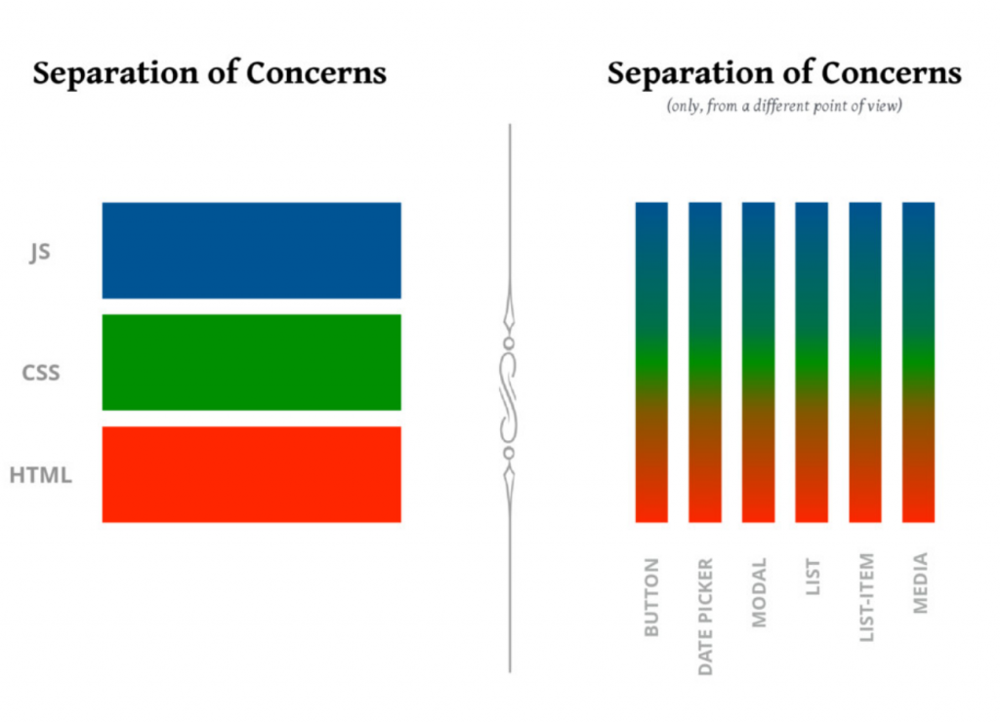
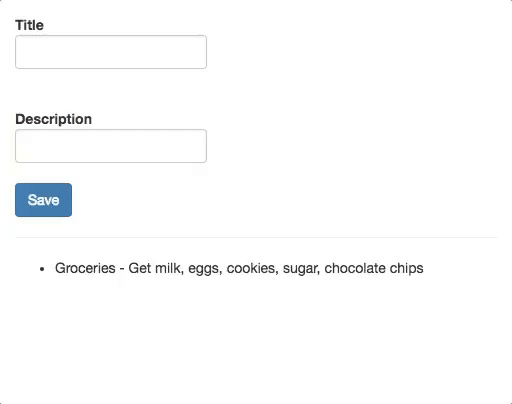

# Introduction to React

# Objectives

By the end of this chapter, you should be able to:

- Discuss the history of React.js
- Highlight key features of the React library
- Describe how React's component-based design compares to traditional approaches to building web pages

# React Prerequisites

In this course, we will be using many advanced JavaScript features, so it is important that you are comfortable with basic Javascript.

# Introduction to React

React.js is a lightweight JavaScript library that is used to build user interfaces. 
Put another way, it's responsible for the **V** in the MVC pattern (Model View Controler when M and C belongs to you back-end/API), and doesn't concern itself with models or views.

React is a declarative library, and in fact there are only a handful of concepts and methods you need to understand. However, these concepts will force you to fundamentally rethink your approach to building web pages with HTML, CSS, and JavaScript. So even though the library is small, it can take some time to get used to!

Before we get into what React.js does, let's learn a bit about its history and what sets it apart from other libraries and larger JavaScript frameworks.

# A Brief History of React.js

React.js was built internally at Facebook in 2011, and was released as an open source project in 2013. 
It originally evolved out of a PHP extension built at Facebook called [XHP](https://www.facebook.com/notes/facebook-engineering/xhp-a-new-way-to-write-php/294003943919/). XHP helped secure PHP projects against XSS attacks, and also encourage developers to think about their applications in terms of smaller units of functionality, called components (more on this later). But while XHP was a server-side technology, React.js can be used in the browser.

To learn more about the history of React, you can check out these articles:

- [JavaScript’s History and How it Led To ReactJS](https://thenewstack.io/javascripts-history-and-how-it-led-to-reactjs/)
- [Why did we build React?](https://reactjs.org/blog/2013/06/05/why-react.html)

# Core Features of React.js

- **A Declarative API**. When you're building UIs in React, you don't need to know how React is making changes to the view (though we'll dig into it here). You just need to tell React what to do, and you don't need to worry about the implementation details.

- **Virtual DOM**. Rather than storing the state of the user interface inside of the DOM, React.js stores your application's state in pure JavaScript. When the UI needs to change in response to some user interaction, React updates the state in JavaScript before determining which DOM nodes it needs to change, and how. By minimizing the amount of DOM manipulation it needs to do, React.js can stay fast, even if the DOM has hundreds or thousands of elements.

- **Component-based design**. One of the key concepts in React is the idea of components. A component is a reusable element that can be displayed on the web page, or a higher level component that controls view components. When you use React, you are ultimately creating components that are modular enough to be reused many times and potentially in many places in your application. This is best understood by example, we'll take a closer look at this soon.

- **One-way data flow**. In React, application state that can change should be owned by one component, and it should share that data with other components as needed. Most importantly, there should be one single source of truth for every piece of application state. React's API forces you to think critically about where state should live in your application, and how it should be passed around two different parts of your application. This is in stark contrast to certain other frameworks, in particular, earlier versions of Angular.js, which touted two-way data binding as a core feature. (For more on this distinction, check out [this](http://johndepippo.com/2017/05/23/two-way_data_binding_vs_one-way_data_flow/) article.)

- **JSX**. When building projects with react, we'll be using a syntax called JSX, which is basically an HTML-JavaScript hybrid. When writing with JSX, you'll effectively be able to write HTML directly inside of your JavaScript code!

# Thinking in React.js

As mentioned before, the hardest part about learning React is rethinking how you build web pages with HTML, CSS, and JavaScript.

The best illustration of the paradigm shift that React provides is in this image, which comes from a 2017 talk by Cristiano Rastelli 
called [Let There Be Peace On CSS](https://speakerdeck.com/didoo/let-there-be-peace-on-css):



Traditionally, when you're building a user interface for the web, you separate your code by file extension: HTML, CSS, or JavaScript. But often, the code inside of these different files is closely connected: to create a button, for instance you'll need a button tag in your HTML, some style rules in your CSS, and some logic for what should happen when a user clicks on the button in your JavaScript. Having to hop around between all of these different files can be cumbersome, especially when you start dealing with complex interfaces for large web applications.

React takes a different approach, by treating the component (e.g. the button) as the unit of functionality. Rather than having to think of your application as a collection of HTML, CSS, and JavaScript files, with React you will learn to think of your applications in terms of components: buttons, navbars, lists, cards, and so on.

# Building an Application Using Components

To solidify the idea of components, let's think about how we could design a to-do list application using react components. We want to make a to-do list app that works like our example below.



The app has a an HTML `li` element for each item in our to-do list plus a form in which users can enter new to-do items by providing a title and a description. If we were to break this app down, we might make the following components:

- A `TodoListItem` component that can be reused for each to-do item in the list
- A `TodoListForm` component that allows the user to type and submit new to-do items.
- A `TodoListApp` component that uses the TodoListItems and the `TodoListForm` to create the entire to-do list application.
Even in this small example, you may have noticed that we are using smaller components to build a larger component. Specifically, we are using the TodoListItem and the `TodoListForm` to create the TodoListApp. This concept is called composition and it is frequently used in React.

We will see more concrete component examples as we go, but it's useful to get a preview of these concepts before we get started.

# Example Syntax

Let's get started by writing some (broken) React code! To kick things off, let's make a small HTML file, load React, and load our own JavaScript file (called `app.js`):

```html
<!DOCTYPE html>
<html lang="en">
<head>
  <meta charset="UTF-8">
  <title>My First React App</title>
</head>
<body>
  <div id="app"></div>
  <script crossorigin src="https://unpkg.com/react@16/umd/react.development.js"></script>
  <script crossorigin src="https://unpkg.com/react-dom@16/umd/react-dom.development.js"></script>
  <script src="app.js"></script>
</body>
</html>
```

Note that we need two scripts in order to get started with React. The first is the React library and the second is the ReactDOM library, which is used for rendering to the DOM. These libraries are isolated as there are environments where we can use React and not have access to a DOM (like mobile development, game development, or even command line scripts).

Next, let's write some React code inside of our `app.js`. Here's an example of some code that uses JSX!

```js
class App extends React.Component {
  render() {
    return (
      <div>
        <h1>Here's my first React App!</h1>
      </div>
    );
  }
}

ReactDOM.render(<App />, document.getElementById("app"));
```

Unfortunately, if you try to open up this page in the browser, it will break. This is because the code we've written isn't valid JavaScript! We can't just write HTML inside of a JavaScript file, and the browser doesn't know how to deal with JSX. In order to get this code working, we'll need another tool, called Babel. To learn more about Babel, JSX, and the basics of writing code with React, read on.

# Next

When you're ready, move on to [**JSX and Babel**](./02-jsx-babel.md)