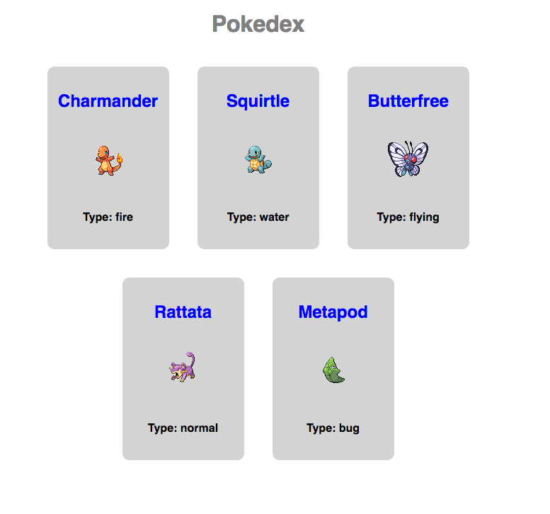

# Props

# Objectives

By the end of this chapter, you should be able to:

- Define what `props` is and how it is used with React
- Describe what the `children` prop is used for
- Use `PropTypes` and `defaultProps`

# Props

We have already seen props being used in our components, but let's take closer look at how they work. Any component that you create can accept props. Often a prop may be passed down from a parent component to a child. The most important thing to understand about props are that they are **immutable**. Props can not be changed from within the component itself. In other words, props are read only data. You should not be trying to change the value of a prop. To make dynamic content that can changed based on input, we will be exploring state in the next lesson.

Let's start with an example of a ES2015 component that uses props.

# React Component: Our First Props Example

In the example below, we are creating our React components a little differently than we have in previous examples. Now with the power of webpack and babel, we can separate components into different files.

First, we no longer have React defined globally. To use `React` and the `Component` class that we are extending, 
we must import them from `'react'`.

Lastly, notice that we want to export the class that we are creating so that we can use it in other files. One way to export the class is to add `export default` to the class definition:

```jsx
import React, { Component } from "react";
import { render } from "react-dom";

export default class App extends Component {
  render() {
    return (
      <div>
        <h1>Hello {this.props.name}</h1>
      </div>
    );
  }
}

// Example of calling render with the Component
render(<App name="Elie" />, document.getElementById("main"));
```

Try running the code from above by using `create-react-app`. You will need to modify 2 files. First, modify `App.js` to contain the import statements from above as well as the App component code (Do not include the render method call in this file). Next, inside of index.js, modify the `ReactDOM.render` code to pass in the prop `name="Elie"`. Make sure you can get this example to run before moving on. If you get stuck, ask us for help.

# Children

A special property that all react components have is called `children`. The `children` of a component is all of the JSX inside of the component. For example, think of html tags:

```html
<div>
   <p>I am a child element of the div</p>
   <p>I am another child of the div</p>
</div>
```

In the example, the `p` tags are children of the `div` tag. The same relationship is true in JSX:

```html
<Parent>
  <h2>These are the children!</h2>
</Parent>
```

In this example we have a `Parent` component that has a `h2` tag as a child. Inside of the class for the `Parent` component, 
`this.props.children` would contain the `h2` in this case.

Here is a full example of the `Parent` component:

```jsx
import React, { Component } from "react";
import { render } from "react-dom";

class Parent extends Component {
  render() {
    return (
      <div>
        <h1>Hi Kids!</h1>
        {this.props.children}
      </div>
    );
  }
}

class App extends Component {
  render() {
    return (
      <Parent>
        <h2>These are the children!</h2>
      </Parent>
    );
  }
}

render(<App />, document.getElementById("main"));
```

[You can see this in CodePen here](https://codepen.io/eschoppik/pen/JroWLy)

# Prop Validation with PropTypes

As your app grows larger, it can sometimes be hard to understand which props a component actually accepts. One way to describe the props that a component accepts is `PropTypes`. Using `PropTypes` also has the added benefit of doing some type checking (type checking asserts that the data that you are getting is a certain type. For example, this prop should be a string!).

First, you should `npm install prop-types` as an external package.

Here is an example of using `PropTypes` in action (taken from the [React docs](https://facebook.github.io/react/docs/typechecking-with-proptypes.html)):

```jsx
import PropTypes from "prop-types";

class Greeting extends React.Component {
  render() {
    return <h1>Hello, {this.props.name}</h1>;
  }
}

Greeting.propTypes = {
  name: PropTypes.string
};
```

Notice that the `PropType` declaration for `Greeting` is not part of the class and is after the class definition.

You can read more about propTypes in the [facebook docs](https://facebook.github.io/react/docs/typechecking-with-proptypes.html).

# Default Props

You can define default values for your props by assigning to the special defaultProps property:

```jsx
class Greeting extends React.Component {
  render() {
    return <h1>Hello, {this.props.name}</h1>;
  }
}

// Specifies the default values for props:
Greeting.defaultProps = {
  name: "Stranger"
};
```

# Composing Components With Props

So far the data that has been passed in as props has been simple strings. Let's look at an example where the `defaultProps` are a little more complex:

```jsx
import React, { Component } from "react";

export default class App extends Component {
  render() {
    const instList = this.props.instructors.map(instructor => {
      return (
        <li key={instructor.id}>
          <h2>{instructor.name}</h2>
          
          <p>
            <strong>Hobby:</strong> {instructor.hobby}
          </p>
        </li>
      );
    });
    return (
      <div>
        <h1>Instructors</h1>
        <ul>{instList}</ul>
      </div>
    );
  }
}

// Specifies the default values for props:
App.defaultProps = {
  instructors: [
    {
      id: 0,
      name: "Michael",
      avatar:
        "https://www.rithmschool.com/content/react_fundamentals/michael.jpg",
      hobby: "hiking"
    },
    {
      id: 1,
      name: "Matt",
      avatar: "https://www.rithmschool.com/content/react_fundamentals/matt.jpg",
      hobby: "math"
    },
    {
      id: 2,
      name: "Elie",
      avatar: "https://www.rithmschool.com/content/react_fundamentals/elie.jpg",
      hobby: "cello"
    },
    {
      id: 3,
      name: "Whiskey",
      avatar:
        "https://www.rithmschool.com/content/react_fundamentals/whiskey.jpg",
      hobby: "napping"
    }
  ]
};
```

In the above example we have an array of instructors that we want to show in a list. So inside of render, we are doing a map over our instructor props and we are returning an array of JSX elements. We can then evaluate that array directly in the JSX code when we do the following:

```jsx
<ul>{instList}</ul>
```

You may have also noticed that the `li` being returned from the callback function in `map` has an attribute that we have not talked about. key is a special prop in react that helps react render our components more intelligently. The `key` should be set to something that uniquely identifies your data in some list of data. Typically, the `key` will be some id that is coming from the server. Generally speaking, the key should not be an index in an array because if the array order ever changes, then your `key` will change. So the rule of thumb is to set the key to some data that uniquely identifies the element in the list and that will not change over time.

# Refactoring Our Component

Let's refactor our previous example. Instead of writing all of that JSX inside of `map`, let's create another component. The component is an `InstructorItem` and it will be responsible for displaying information about 1 instructor:

```jsx
import React, { Component } from "react";
import PropTypes from "prop-types";

export default class InstructorItem extends Component {
  render() {
    return (
      <li>
        <h2>{this.props.name}</h2>
        
        <p>
          <strong>Hobby:</strong> {this.props.hobby}
        </p>
      </li>
    );
  }
}

InstructorItem.propTypes = {
  name: PropTypes.string,
  avatar: PropTypes.string,
  hobby: PropTypes.string
};
```

Now that we have an `InstructorItem` component that represents one instructor, we can use the component instead of the App component to display each instructor. Assuming our instructor component is in a file called `InstructorItem.js`, our refactored app could would look like this (The default props have been omitted for brevity):

```jsx
import React, { Component } from "react";
import InstructorItem from "./InstructorItem";

export default class App extends Component {
  render() {
    var instList = this.props.instructors.map(instructor => {
      return (
        <InstructorItem
          key={instructor.id}
          name={instructor.name}
          avatar={instructor.avatar}
          hobby={instructor.hobby}
        />
      );
    });
    return (
      <div>
        <h1>Instructors</h1>
        <ul>{instList}</ul>
      </div>
    );
  }
}
```

Notice now that we're using the `InstructorItem` component inside of the callback for map rather than writing the html ourselves.

We have seen a lot of what can be done with props at this point, but unfortunately so far we have just made a static website! All of this could have been done with just HTML and CSS. To make our app dynamic, we need to add state!

# Exercises

## Props Exercises

Create a pokemon application (a pokedex) that displays an interface that looks like this:



To create the pokedex, you should use 2 components, a `Pokedex` component and a `Pokecard` component.  The `Pokedex` should be the parent component and it will create 5 `Pokecard` components for each pokemon that will be shown.

The application should use `defaultProps` to get the data for the pokedex. Here is the data for the `defaultProps`:

```js
{
  pokemon: [
    {
      id: 1,
      name: "Charmander",
      type: "fire",
      image: "https://raw.githubusercontent.com/PokeAPI/sprites/master/sprites/pokemon/4.png"
    },
    {
      id: 2,
      name: "Squirtle",
      type: "water",
      image: "https://raw.githubusercontent.com/PokeAPI/sprites/master/sprites/pokemon/7.png"
    },
    {
      id: 3,
      name: "Butterfree",
      type: "flying",
      image: "https://raw.githubusercontent.com/PokeAPI/sprites/master/sprites/pokemon/12.png"
    },
    {
      id: 4,
      name: "Rattata",
      type: "normal",
      image: "https://raw.githubusercontent.com/PokeAPI/sprites/master/sprites/pokemon/19.png"
    },
    {
      id: 5,
      name: "Metapod",
      type: "bug",
      image: "https://raw.githubusercontent.com/PokeAPI/sprites/master/sprites/pokemon/11.png"
    }
  ]
}
```

# Next

When you're ready, move on to [**State**](./05-state.md)